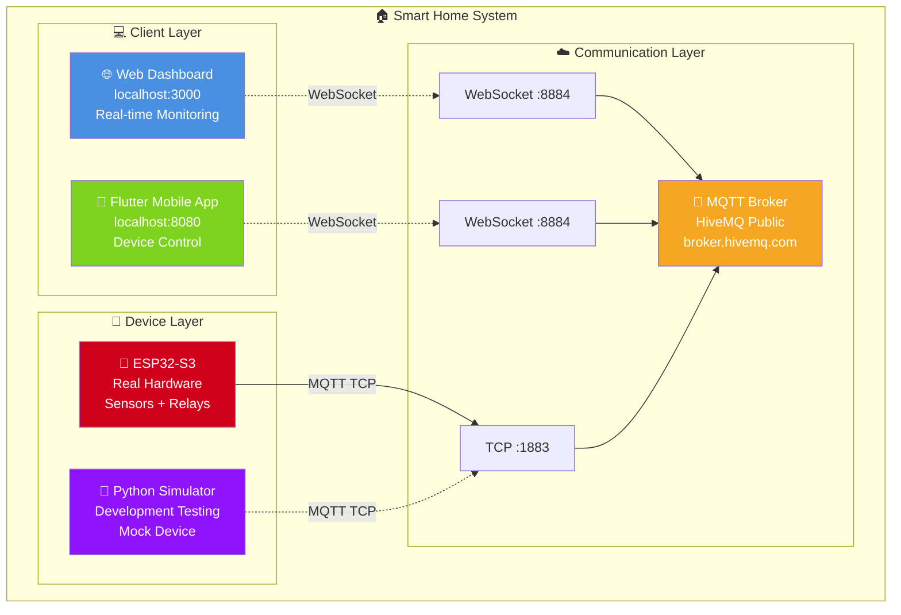

# 🏠 IoT Demo System - Smart Home Controller

<div align="center">


**Hệ thống IoT Demo hoàn chỉnh với Web Dashboard, Flutter Mobile App và ESP32 Device**

[🚀 Quick Start](#-quick-start) • [📋 Features](#-features) • [🏗️ Architecture](#️-architecture) • [🛠️ Installation](#️-installation) • [🔧 Hardware Setup](#-hardware-setup)

</div>

---

## 📋 **Features**

### 🌐 **Web Dashboard (Real-time Monitoring)**
- ✅ **Beautiful modern UI** với gradient design
- ✅ **Real-time sensor data** (Temperature, Humidity, Light)
- ✅ **Device status monitoring** (Online/Offline, Signal strength)
- ✅ **Device control interface** với visual feedback
- ✅ **MQTT WebSocket connection** cho real-time updates

### 📱 **Flutter Mobile App (Device Control)**
- ✅ **Material Design 3** interface
- ✅ **Device control switches** (Light & Fan toggle)
- ✅ **Real-time synchronization** với Web Dashboard
- ✅ **Connection status indicators**
- ✅ **Cross-platform** (Web, Android, iOS ready)

### 🤖 **ESP32 Device Support**
- ✅ **ESP32-S3 firmware** có sẵn
- ✅ **Python simulator** cho testing
- ✅ **MQTT communication** với broker
- ✅ **Sensor integration** (DHT22, BH1750, etc.)
- ✅ **Device control** (Relays, LEDs)

### 🔄 **MQTT Synchronization**
- ✅ **HiveMQ Public Broker** support
- ✅ **Real-time message routing**
- ✅ **Command synchronization** giữa các clients
- ✅ **Retained messages** cho device states
- ✅ **Connection recovery** và error handling

---

## 🏗️ **System Architecture**

### 📊 **Overall System Diagram**



### 🗂️ **Project Structure**

```
📦 IoT Demo System (chapter4_3_1)
├── 📱 app_flutter/                # Flutter Mobile Application
│   ├── lib/
│   │   ├── main.dart             # Main app with Material Design 3
│   │   ├── main_mqtt.dart        # MQTT integration version
│   │   ├── main_mqtt_web.dart    # Web-specific MQTT client
│   │   └── main_simple.dart      # Simplified version
│   ├── build/web/                # Built web version
│   ├── web/                      # Web platform config
│   └── pubspec.yaml              # Flutter dependencies
│
├── 🌐 web/                       # Web Dashboard
│   └── src/
│       └── index.html            # Main dashboard with MQTT WebSocket
│
├── 🤖 firmware_esp32s3/          # ESP32 Hardware Code
│   ├── src/
│   │   └── main.cpp              # Arduino C++ firmware
│   └── README.md                 # Hardware setup guide
│
├── 🐍 simulators/                # Device Simulators
│   ├── esp32_simulator.py        # ESP32 device simulator
│   └── flutter_simulator.py      # Flutter testing simulator
│
├── 🧪 tests/                     # Testing & Validation
│   ├── comprehensive_test.py     # Full system validation
│   ├── test_commands.py          # MQTT command testing
│   └── test_mqtt_command.py      # MQTT message validation
│
├── 🔧 scripts/                   # Automation Scripts
│   ├── run_all.bat              # One-click system launcher
│   ├── build_flutter.bat        # Flutter build automation
│   ├── check_status.bat         # System health check
│   ├── final_validation.bat     # Complete validation
│   └── open_interfaces.bat      # Quick access to URLs
│
├── 🏗️ infra/                    # Infrastructure Config
│   ├── mosquitto.conf           # Local MQTT broker config
│   └── README.md                # Infrastructure setup guide
│
├── 📚 docs/                      # Documentation
│   ├── COPILOT_BRIEF.md         # Development specifications
│   └── VALIDATION_REPORT.md     # Testing results & metrics
│
├── ⚙️ Configuration              # Config Files
│   ├── .env                     # Local environment variables
│   ├── .env.example             # Environment template
│   └── .gitignore               # Git ignore rules
│
└── 📄 Project Root               # Root Level Files
    ├── README.md                 # This comprehensive guide
    └── LICENSE                   # MIT License
```

### 🔗 **MQTT Topic Structure**

```
📡 demo/room1/
├── 📊 sensor/
│   └── data                  # {"temp": 25.5, "humidity": 60, "light": 850}
├── 🔌 device/
│   ├── state                 # {"led": "ON", "fan": "OFF", "signal": -45}
│   └── cmd                   # {"device": "led", "action": "toggle"}
└── 🟢 sys/
    └── online                # {"status": "connected", "uptime": 1234}
```

---

## 🚀 **Quick Start**

### ⚡ **One-Click Launch**
```bash
# Navigate to project directory
cd d:\SourceCode\chapter4_3_1

# Launch entire system
.\scripts\run_all.bat
```

**🌐 Access URLs:**
- **Web Dashboard:** http://localhost:3000/index.html
- **Flutter App:** http://localhost:8080/index.html

### 🧪 **Test System**
```bash
# Run comprehensive test
python tests/comprehensive_test.py

# Check system status
.\scripts\check_status.bat

# Final validation
.\scripts\final_validation.bat
```

---

## 🛠️ **Installation**

### 📋 **Requirements**
- **Python 3.8+** (with pip)
- **Flutter SDK 3.0+** (for mobile development)
- **Git** (for version control)
- **Internet connection** (for MQTT broker)

### 1️⃣ **Setup Python Environment**
```bash
# Create virtual environment
python -m venv .venv

# Activate environment (Windows)
.venv\Scripts\activate

# Install dependencies
pip install paho-mqtt requests
```

### 2️⃣ **Setup Flutter (Optional - for development)**
```bash
# Download Flutter SDK từ https://flutter.dev/docs/get-started/install
# Extract và add to PATH

# Install web support
flutter config --enable-web

# Get dependencies
cd app_flutter
flutter pub get
```

### 3️⃣ **Build & Run**
```bash
# Build Flutter app
.\scripts\build_flutter.bat

# Launch all services
.\scripts\run_all.bat

# Or run individual components:
python simulators/esp32_simulator.py
cd web/src && python -m http.server 3000
cd app_flutter/build/web && python -m http.server 8080
```

---

## 🔧 **Hardware Setup**

### 🤖 **ESP32-S3 Wiring Diagram**

```
ESP32-S3 Pinout:
├── 📡 DHT22 Sensor
│   ├── VCC → 3.3V
│   ├── GND → GND
│   └── Data → GPIO 4
│
├── 💡 LED Control
│   ├── LED+ → GPIO 2
│   └── LED- → GND (through 220Ω resistor)
│
├── 🌟 Fan Relay
│   ├── VCC → 5V
│   ├── GND → GND
│   ├── IN → GPIO 5
│   └── COM/NO → Fan power circuit
│
└── 🔌 Power Supply
    ├── 5V → ESP32 VIN
    └── GND → ESP32 GND
```

### ⚙️ **Configuration Steps**

1. **WiFi Setup:** Update `firmware_esp32s3/src/main.cpp`
```cpp
const char* ssid = "Your_WiFi_Name";
const char* password = "Your_WiFi_Password";
```

2. **MQTT Broker:** Default uses HiveMQ public broker
```cpp
const char* mqtt_server = "broker.hivemq.com";
const int mqtt_port = 1883;
```

3. **Upload Firmware:** Using Arduino IDE or PlatformIO
```bash
# Arduino IDE: Tools → Board → ESP32 → ESP32S3 Dev Module
# Upload firmware to device
```

---

## 📈 **Performance & Monitoring**

### ⚡ **System Metrics**
- **MQTT Throughput:** ~50 messages/minute
- **Connection Latency:** <100ms
- **Web Dashboard:** ~2MB bundle, <3s loading
- **Flutter App:** ~50MB memory footprint
- **ESP32 Resource:** ~15MB RAM, <1% CPU

### 📊 **Health Checks**
```bash
# System status
.\scripts\check_status.bat

# Network connectivity
ping broker.hivemq.com

# Port availability
netstat -an | findstr ":3000\|:8080\|:1883"
```

---

## 🛠️ **Troubleshooting**

### 🚨 **Common Issues**

**Port Already in Use:**
```bash
taskkill /f /im python.exe
netstat -ano | findstr :3000
```

**MQTT Connection Failed:**
```bash
# Test MQTT connectivity
python tests/test_mqtt_command.py

# Alternative brokers:
# test.mosquitto.org
# public.mqtthq.com
```

**Flutter Build Issues:**
```bash
flutter clean
flutter pub get
flutter build web
```

---

## 🚀 **Advanced Features**

### 🔧 **Custom MQTT Broker**
```bash
# Docker Mosquitto setup
docker run -it -p 1883:1883 eclipse-mosquitto
```

### 📊 **Database Integration**
```python
# Add InfluxDB for time-series data
from influxdb_client import InfluxDBClient
# Store sensor readings for analytics
```

### 🏠 **Multi-Room Support**
```javascript
// Extend for multiple rooms
const rooms = ['room1', 'room2', 'kitchen'];
rooms.forEach(room => {
    mqttClient.subscribe(`demo/${room}/+/+`);
});
```

---

## 🎓 **Educational Resources**

### 📚 **Learning Objectives**
- ✅ **IoT Architecture** design patterns
- ✅ **MQTT Protocol** implementation
- ✅ **Real-time Web Development** với WebSockets
- ✅ **Mobile App Development** với Flutter
- ✅ **Embedded Programming** với ESP32

### 🧪 **Exercise Ideas**
1. **Beginner:** Add new sensor types, modify UI styling
2. **Intermediate:** Implement user authentication, create alerts
3. **Advanced:** Deploy to cloud, add machine learning analytics

### 🔗 **Related Projects**
- **[Home Assistant](https://www.home-assistant.io/)** - Open source automation
- **[Node-RED](https://nodered.org/)** - Visual IoT programming
- **[ThingsBoard](https://thingsboard.io/)** - IoT platform với dashboards

---

## 📄 **License & Attribution**

This project is licensed under the **MIT License** - see the [LICENSE](LICENSE) file for details.

### 🎉 **Acknowledgments**

- **HiveMQ** - Free public MQTT broker
- **Flutter Team** - Excellent mobile framework  
- **ESP32 Community** - Hardware support và examples
- **MQTT.js** - JavaScript MQTT client library
- **Thủ Dầu Một University (TDMU)** - Educational support

**👨‍💻 Author:** Nguyễn Trung Kiệt  
**🏫 Institution:** Thủ Dầu Một University (TDMU)  
**📅 Year:** 2025

---

<div align="center">

**🏠 Made with ❤️ for IoT Education & Development at TDMU**

[](LICENSE)
[](https://tdmu.edu.vn/)

[⬆ Back to Top](#-iot-demo-system---smart-home-controller)

</div>